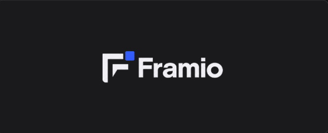
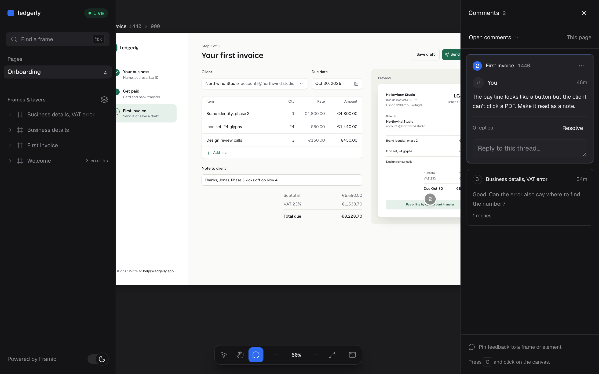

<a href="https://framio.design">
  
</a>

A design canvas for coding agents.

Your agent writes designs as React + Tailwind files. Framio shows them live on an infinite
canvas, so you can watch the work and point at what to change.



## Install

```sh
curl -fsSL https://framio.design/install.sh | sh
```

On Windows, run this in PowerShell:

```powershell
irm https://framio.design/install.ps1 | iex
```

Supports macOS on Apple Silicon, Linux x64 and arm64, and Windows x64 on Windows 10
version 1809 or later. `framio add` also needs Node.js. Windows installation adds
`~/.framio/bin` to your user PATH without administrator access.

## Quick start

In your project:

```sh
framio init    # set up .framio/ with shadcn/ui and the agent skill
framio start   # open the canvas (Ctrl+C to stop)
```

Then ask your agent:

> Use Framio to design the onboarding for my invoicing app.

Setup shows separate progress for canvas files, agent skills, packages, and the screenshot
browser. `framio init --skip-install` creates files and prints the commands to finish setup.

Use `--verbose` with `init`, `install`, or `add` to see full subprocess logs. Failed commands
print their diagnostics and a retry instruction.
`framio start --verbose` also shows runtime build diagnostics. Background canvases write
those diagnostics to the log path printed at startup.

Interactive terminals show an ASCII Framio mark and live task states. `NO_COLOR` disables
color. CI, dumb terminals, and redirected output use plain text without cursor animation.
`framio inspect` keeps its JSON output, and redirected `framio list` keeps tab-separated rows.

The agent grounds the brief in confirmed product facts and builds the actual hero or key
screen before expanding the design. Its chosen composition,
screenshots, and review changes are visible in the canvas's Design evidence panel.

### Remote machines and VMs

`framio start` listens on all IPv4 interfaces by default and prints local and network
URLs. If Tailscale is running, it also prints the Tailscale IP and, when MagicDNS is
enabled, its hostname. SSH into your VM, start Framio, and open its Tailscale URL in
the browser on your main computer. Tailscale discovery is optional and never blocks
startup for more than a brief timeout.

SSH and headless Linux sessions skip opening a browser on the server. A missing
browser launcher does not stop the canvas. No desktop browser or display is required
on the VM. Framio downloads its own headless Chromium for screenshots, thumbnails,
and geometry inspection. Those features need Chromium's system libraries and sandbox
support. If Chromium is unavailable, live previews remain usable and failed thumbnails
show a message. Clipboard actions also support remote HTTP sessions.

Use `framio start --host 127.0.0.1` for local-only access, or `--host <address>` to
bind a specific interface. Anyone who can reach the port can edit the canvas, so keep
access limited to your trusted network with your firewall and Tailscale access rules.
Tailscale encrypts HTTP traffic through its tunnel. HTTPS needs a separate setup,
such as Tailscale Serve.

## What goes where

Everything lives in `.framio/`:

| Path            | What it is                                             |
| --------------- | ------------------------------------------------------ |
| `BRIEF.md`      | The product, its users, and the scope                  |
| `DESIGN.md`     | Colors, fonts, and radii (see below)                   |
| `pages/`        | One folder per canvas page: moodboards, screens, flows |
| `comments.json` | Pinned feedback, replies, and open/resolved status     |
| `assets/`       | Images used in designs, served at `/assets/<file>`     |

Drop images into a page folder to use them as a moodboard.

## Theming

Edit the front matter in `DESIGN.md` and the canvas updates on save:

```yaml
---
colors:
  primary: "#B8422E"
  primary-dark: "#E0694F" # used in dark mode
typography:
  body-md:
    fontFamily: Public Sans
    fontSize: 15px
rounded:
  lg: 14px
---
```

Colors use shadcn names (`primary`, `background`, `muted`, ...), so the bundled components pick
them up. Fonts load from Google Fonts. The file follows
[Google's DESIGN.md format](https://github.com/google-labs-code/design.md).

## Commands

| Command                                                   | What it does                                                               |
| --------------------------------------------------------- | -------------------------------------------------------------------------- |
| `framio init`                                             | Set up `.framio/` in the current folder                                    |
| `framio start`                                            | Run the canvas (`--background` to detach, `--no-open` to skip the browser) |
| `framio stop`                                             | Stop the canvas (`--all` for every project)                                |
| `framio status` / `list`                                  | Show this server / all servers                                             |
| `framio open`                                             | Open a running canvas in the browser                                       |
| `framio screenshot <frame>`                               | Save frames and top-level layer crops (`--page`, `--all`, `--scale=2`)     |
| `framio screenshot <frame> --layer "<path>"`              | Capture a named layer with context; repeat for several layers              |
| `framio inspect <frame> [--width <n>] [--layer "<path>"]` | Print layer geometry, styles, spacing, and design checks as JSON           |
| `framio screenshot --url <url>`                           | Capture an app or website (`--width=1440`, `--height=900`, `--scale=1`)    |
| `framio screenshot --url <url> --compare <page>/<frame>`  | Design left, implementation right, plus both single PNGs                   |
| `framio screenshot --url <url> --into <page>`             | Add the current app to a moodboard with a URL sidecar                      |
| `framio add <component>`                                  | Add a shadcn registry component                                            |
| `framio install <package>`                                | Add an npm package for designs to use                                      |
| `framio evidence`                                         | Read the brief, selected composition, captures, and review status          |
| `framio evidence --write <file> --expect <revision>`      | Validate and save an evidence document without replacing a newer edit      |

`framio add` preserves existing component files by default and reports installed, skipped,
and failed destinations. Use `--overwrite` only when you intend to replace existing files.
The installer verifies its completion receipt rather than treating a zero exit as proof.

## Design evidence

Open **Design evidence** in the canvas sidebar to see the product brief, confirmed facts,
assumptions, and selected composition. Direction links jump to their actual canvas frames.
Technical inspection and composition review remain
separate, and each review links to the exact screenshot and viewport it examined.

Screenshot receipts print the viewport, build generation, revision, capture ID, and actual
image paths. Framio also archives each image so a later capture cannot change an earlier
review's evidence. Reviews become outdated after frame, theme, asset, metadata, or design
decision changes. A recorded pass covers its screenshot and scope, not every viewport.

The agent maintains `.framio/evidence.json`. Run `framio evidence` before preparing an update,
preserve existing entries, and pass its returned revision to `--expect`. For a missing file,
use `--expect new`. Framio refuses malformed records and conflicting writes. It keeps recent
captures and any capture referenced by a review across server restarts.

## Layers

Name meaningful parts of a design with plain JSX:

```tsx
<div className="min-h-screen">
  <header data-layer="Header">…</header>
  <main data-layer="Content">
    <section data-layer="Balance Card">…</section>
  </main>
</div>
```

The Layers panel sits below Pages. Select a frame to see its tree, hover to outline a layer,
and click to select it. Clicking inside a frame reveals the nearest named layer. Repeated
siblings group into one row; paths such as `Content/Transaction Row[2]` select an instance.
An omitted index means the first match. Avoid `/`, `[` and `]` in names.

Double-click a name to rename its JSX string literal, including in shared components. A mapped
list shares one source name, so renaming updates every instance. Expression names and stale
or ambiguous source locations are refused.

Name every direct child of the frame root. Missing names produce non-blocking warnings on
the canvas, in the panel, in `.framio/.state/errors.json`'s additive `warnings` array, and in
screenshot output. Selection keeps its existing fields and adds `layer: { path, name }`.

Full-frame screenshots also save top-level crops under `<slug>.layers/`, or
`<slug>@<width>.layers/` for responsive frames, and print the layer tree with sizes. Layer crops include 8px of surrounding context and use 1–2× scale to approach
1,500px on the longest side. For very tall layers, screenshot a child layer.

`framio inspect` checks text and child overflow, stack gaps, near alignment, the 4px spacing
grid, text contrast, and interactive target sizes. These geometry checks guide review; text
contrast assumes the measured flat background and cannot judge images, gradients, or overlays.
Use `--width` with screenshot or inspect to review one responsive viewport. Layer crops
require frame arguments; they cannot be combined with URL, page, or all-frame captures.
Review the opening composition before extending a page, then use focused layer crops and
full primary and mobile screenshots. Bound aesthetic revisions; fix functional defects and
reconsider a weak composition instead of repeatedly polishing it.

## Responsive frames

Use one component at several sizes:

```tsx
export const meta = {
  name: "Invoices",
  widths: [1440, 768, 390],
  height: 900,
  // heights: [900, 1024, 844], // optional overrides in widths order
};
```

The first width is primary. Viewports appear side by side, largest first, and move as a group.
Select any viewport individually; the agent's selection includes its width. Desktop heights
use `meta.height`, tablet widths 600–1023 use 1024, and widths below 600 use 844. Frames still
grow to fit content. Existing frames with `width` and `height` behave as before.

`framio screenshot <page>/<frame>` captures all widths as `<slug>@<width>.png`.
Use `--width <n>` for one viewport; page screenshots include all viewports.

## Comments

Press **C** or choose Comment, then click a frame to pin feedback. Enter saves; Escape cancels.
Pins follow the clicked element and stay the same size when you zoom. The right comments panel
lists the page's open feedback. Click a pin or list entry to reply, resolve, reopen, or delete.
Open pins stay visible in Select and Hand; enable "Show resolved" to see resolved pins.

Comments live in `.framio/comments.json`, alongside the designs. Tell your agent to "address the
comments": it reads the file, fixes the frames, replies as `agent`, and resolves verified fixes.
File edits appear live. Invalid comments are reported in the canvas and `.state/errors.json`;
the server preserves the broken file and refuses UI writes until it is fixed.

## Building your app

Ask your agent to build the chosen design in your real app. The Framio skill guides it to port
DESIGN.md tokens and shared components into your app's conventions, replace mock data, and
compare every screen, including its smallest width:

```sh
framio screenshot --url http://localhost:3000/invoices --compare 11-invoices/list --width 390
```

URL captures use managed Chromium, capture the full page, and save to
`.framio/.state/screenshots/urls/`. To capture a redesign's current app on the moodboard, add
`--into 01-moodboard`. It creates an image frame with an editable `{ name, source, note }` sidecar.

## Development

This Bun and Turborepo workspace contains the CLI in `apps/framio` and the Astro
landing app in `apps/landing`. Use Bun 1.4.2 and Node.js 24 or newer.

```sh
bun install
bun run build:ui          # build the canvas UI
bun apps/framio/src/cli.ts <command>  # run from source
bun run test
bun run build:binary      # build a binary for this platform
```

Run `bun run dev:landing` to start Astro, `bun run build:landing` to build it, and
`bun run deploy:landing` to deploy it with Wrangler. See [apps/landing/README.md](apps/landing/README.md)
for the Cloudflare account and domain configuration.

To release, push a tag. GitHub Actions builds the binaries that `install.sh` and `install.ps1` download.

```sh
git tag v0.1.0 && git push origin v0.1.0
```

## Contributing

See [CONTRIBUTING.md](CONTRIBUTING.md). Report security issues privately, as described in
[SECURITY.md](SECURITY.md).

## Update Framio

The sidebar footer shows **Update available** when a newer stable release is found. Hover or focus the control for a short description, or open **About this update** on any device. **Complete release notes** opens the GitHub release.

Click **Update available** to download and verify the release. Framio keeps running. A verified download survives closing Framio. Click **Install update** whenever you are ready. This installs the executable and restarts only the current project at the same URL. Other projects continue running and offer **Restart to update** individually.

```sh
framio upgrade
framio upgrade --check
framio upgrade --download
framio upgrade --install
framio upgrade --rollback
```

The default command shows status and offers an action in an interactive terminal. It makes no implicit mutation in scripts. `--download` only downloads and verifies. `--install` requires an existing verified download and does not download one first. CLI installation lists running projects for you to restart after saving work. `--rollback` restores the retained previous executable. It does not reverse changes to project files.

Update discovery uses GitHub directly, with a shared daily cache, conditional requests and bounded retries. An explicit check refreshes the cache unless GitHub's rate limit is still active. Network failures do not block startup. Updates are stored under `~/.framio/updates`, keyed by the canonical installation path. Custom installation directories are supported. Framio never requests elevation. If your installation is not writable, ask its owner to update it or install Framio in a directory you own.

Source checkouts update through Git. The updater cannot replace Bun or the checkout. Releases without checksums cannot be downloaded through the updater.

Before a canvas restart, pending and active canvas saves must succeed. Close other canvas tabs for the same project after saving their work. Framio refuses a restart while another live canvas tab is connected. Unsubmitted comment and reply drafts stay local to their browser tab across reloads. The page, viewport, selection and panel context are retained. Drafts are never posted automatically.

If the updated server fails to start, the supervisor attempts to start the retained previous executable on the same port. The canvas reports recovery and offers a retry. If neither executable starts, run `framio upgrade --rollback`, then `framio start` in your project. Installation recovery inspects the executable's actual version after an interrupted operation. A dead download owner leaves a retryable failure, never an installable partial archive.

Project setup and skill migrations are separate. If a release requires one, the canvas links to the instructions in its release notes.

## License

[MIT](LICENSE)
